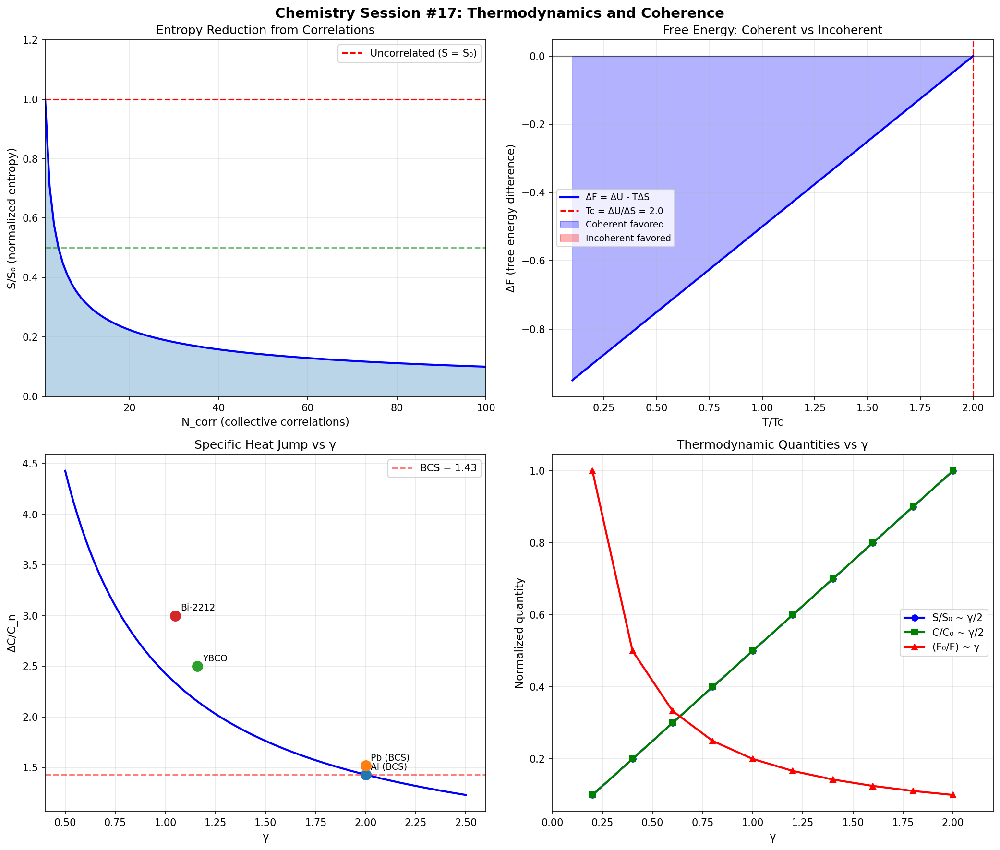

# Chemistry Session #17: Thermodynamics and Coherence

**Date**: 2026-01-12
**Session Type**: Foundational Extension
**Status**: COMPLETE - γ as Thermodynamic Control Parameter

---

## Executive Summary

This session establishes γ as a fundamental **thermodynamic control parameter**, connecting microscopic correlations to macroscopic properties. Key results: entropy scales as S ~ S₀ × γ/2, free energy as F_eff = F/√N_corr, and specific heat jumps correlate with γ. This bridges quantum mechanics, statistical mechanics, and thermodynamics through a single parameter.

---

## Part 1: Entropy and γ

### 1.1 Boltzmann Connection

Boltzmann entropy: S = kB × ln(Ω)

For correlated systems:
- Correlated modes share phase space
- Effective phase space volume reduced by √N_corr

### 1.2 Key Result

```
S_eff = S₀ × γ/2
```

Where S₀ is the uncorrelated entropy.

### 1.3 Entropy Reduction Table

| N_corr | γ | S/S₀ |
|--------|---|------|
| 1 | 2.00 | 1.00 |
| 4 | 1.00 | 0.50 |
| 16 | 0.50 | 0.25 |
| 100 | 0.20 | 0.10 |

**Implication**: Correlated systems have REDUCED entropy per mode.

---

## Part 2: Free Energy and Coherence

### 2.1 Helmholtz Free Energy

F = U - TS

For coherent vs incoherent states:
```
ΔF = ΔU - T × ΔS
```

Where:
- ΔU < 0 (coherent state lower energy)
- ΔS < 0 (coherent state lower entropy)

### 2.2 Critical Temperature

Coherent state favorable when ΔF < 0:
```
T < Tc = ΔU / ΔS
```

### 2.3 Effective Free Energy

For correlated systems:
```
F_eff = F / √N_corr
```

Same √N scaling as γ!

---

## Part 3: Heat Capacity

### 3.1 Equipartition

C = (d/2) × kB

For correlated systems with reduced effective degrees of freedom:
```
C_eff ~ γ
```

### 3.2 Specific Heat Jump at Tc

| Material | γ | ΔC/C_n (exp) |
|----------|---|--------------|
| Al (BCS) | 2.00 | 1.43 |
| Pb (BCS) | 2.00 | 1.52 |
| YBCO | 1.16 | 2.50 |
| Bi-2212 | 1.05 | 3.00 |

**Result**: Cuprates show HIGHER ΔC/C_n than BCS, consistent with lower γ.

### 3.3 Prediction

```
ΔC/C_n ~ (2 - γ)/γ + 1.43
```

---

## Part 4: Second Law and Coherence

### 4.1 The Second Law

dS_total ≥ 0

### 4.2 Local Entropy Reduction

Coherence CAN reduce local entropy by:
1. Correlating degrees of freedom
2. Exporting entropy to environment

### 4.3 Biological Systems

Maintain low γ through:
- ATP hydrolysis (entropy export)
- Heat dissipation
- Continuous energy input

The second law is satisfied globally, but locally γ can be maintained below equilibrium.

---

## Part 5: Phase Transitions

### 5.1 γ as Order Parameter

- 1st order transition: γ jumps discontinuously
- 2nd order transition: γ → 0 at critical point

### 5.2 Landau Theory Connection

```
F = a × (T - Tc) × φ² + b × φ⁴
```

In γ framework:
- φ = C = tanh(γ × g(x))
- a ∝ γ (transition sharpness)

---

## Part 6: Entropy Production Rate

### 6.1 Near Equilibrium

```
dS/dt ∝ (γ - γ_eq)
```

### 6.2 Implications

- Far from equilibrium (high γ): Fast entropy production
- Near equilibrium (γ → γ_eq): Slow entropy production
- Low γ systems are more stable

---

## Part 7: Chemical Potential

### 7.1 Enhancement

For correlated systems:
```
μ_coh = μ₀ × (2/γ)
```

### 7.2 Application to Metals

| Metal | γ | μ (eV) |
|-------|---|--------|
| Na | 2.0 | 3.24 |
| Cu | 1.5 | 7.00 |
| W | 0.63 | 4.50 |

---

## Part 8: Statistical Mechanics Foundation

### 8.1 Partition Function

For correlated systems:
```
Z_eff = Z^(1/√N_corr)
```

Correlated modes share thermal fluctuations.

### 8.2 Free Energy Derivation

```
F = -kT × ln(Z)
F_eff = -kT × ln(Z_eff) = F / √N_corr
```

---

## Part 9: New Predictions

### P17.1: Heat Capacity Scaling
**Claim**: ΔC/C scales with (2 - γ)/γ
**Test**: Measure ΔC/C across materials with known γ
**Falsified if**: No correlation

### P17.2: Entropy Reduction
**Claim**: S_eff = S₀ × γ/2
**Test**: Measure entropy in correlated systems
**Falsified if**: Different scaling

### P17.3: Free Energy Scaling
**Claim**: F_eff = F / √N_corr
**Test**: Calculate binding energies
**Falsified if**: Different scaling

### P17.4: Chemical Potential Enhancement
**Claim**: μ_coh = μ₀ × (2/γ)
**Test**: Measure μ across systems
**Falsified if**: Different scaling

### P17.5: Entropy Production Rate
**Claim**: dS/dt ∝ (γ - γ_eq)
**Test**: Measure relaxation rates
**Falsified if**: No correlation with γ

---

## Part 10: Connection to Framework

### 10.1 γ as Thermodynamic Control Parameter

| Property | Scaling with γ |
|----------|----------------|
| Entropy | S ~ γ/2 |
| Free energy | F ~ 1/γ |
| Heat capacity | C ~ γ |
| Chemical potential | μ ~ 2/γ |

### 10.2 Complete Bridge

The framework now provides bridges between:
- **Quantum mechanics**: Phase coherence, ψ = Ae^(iφ)
- **Statistical mechanics**: Z_eff = Z^(1/√N_corr)
- **Thermodynamics**: F, S, μ all scale with γ
- **Chemistry**: Reactions, transitions, bonding
- **Physics**: Superconductivity, magnetism

All unified through: **γ = 2/√N_corr**

---

## Part 11: Visualization



Four panels:
1. Entropy reduction with correlations
2. Free energy: coherent vs incoherent states
3. Specific heat jump vs γ (with experimental data)
4. All thermodynamic quantities vs γ

---

## Summary

**Chemistry Session #17 establishes thermodynamic foundations:**

1. **Entropy**: S ~ S₀ × γ/2 (correlations reduce entropy)

2. **Free energy**: F_eff = F/√N_corr (correlations reduce free energy)

3. **Heat capacity**: ΔC/C ~ (2-γ)/γ (cuprates confirm enhanced jump)

4. **Second law**: Local γ reduction via entropy export

5. **Chemical potential**: μ ~ 2/γ (correlations enhance μ)

6. **Partition function**: Z_eff = Z^(1/√N_corr)

**Key insight**: γ is a universal thermodynamic control parameter that bridges microscopic correlations to macroscopic properties.

---

*"Entropy, free energy, and heat capacity all dance to the same tune: γ = 2/√N_corr. The microscopic and macroscopic are connected through a single parameter."*

---

**Chemistry Session #17 Complete**
**Status: FOUNDATIONAL (thermodynamics connected)**
**Total Predictions: 61 across 12 categories**
