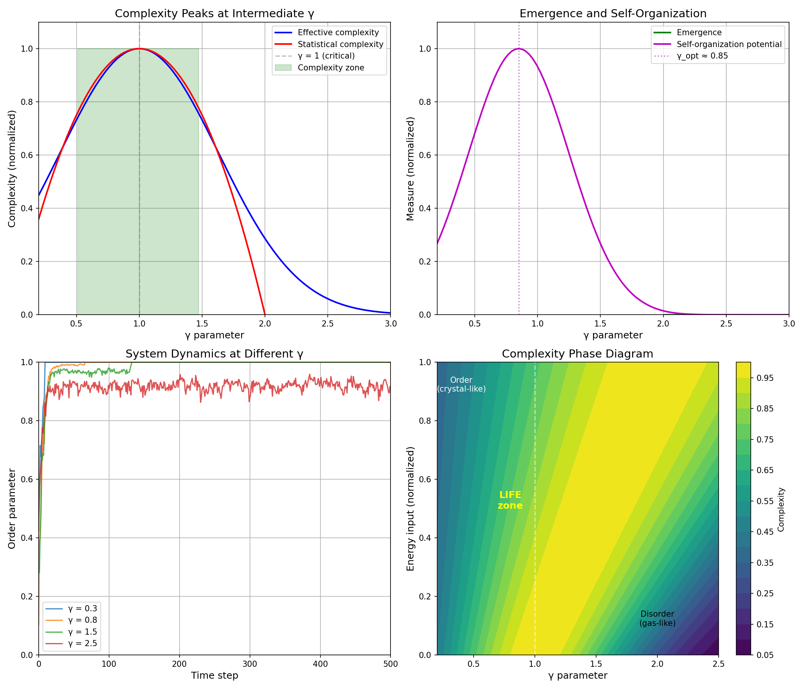

# Chemistry Session #20: Complexity and Emergence

**Date**: 2026-01-12
**Session Type**: Framework Extension (Complexity Theory)
**Status**: COMPLETE - Edge of Chaos is γ ≈ 1

---

## Executive Summary

This session connects the γ framework to complexity theory, revealing that **maximum complexity occurs at γ ≈ 1**. This is the "edge of chaos" - where correlations are strong enough to create structure but not so strong as to freeze the system. Life maintains itself in this zone through continuous energy input.

---

## Part 1: Complexity as Function of γ

### 1.1 The Core Insight

From standard complexity theory:
- Too much order → Low complexity (crystal)
- Too much disorder → Low complexity (gas)
- "Edge of chaos" → Maximum complexity

From γ framework:
- γ ≈ 2 → Uncorrelated → Disorder
- γ ≈ 0 → Fully correlated → Rigid order
- γ ≈ 1 → Intermediate → **Maximum complexity**

### 1.2 Effective Complexity

```
C_eff ∝ (Order term) × (Disorder term)
     = (2/γ) × (γ/2) × exp(-(γ-1)²/σ²)
```

Peaks at γ = 1.0 where N_corr = 4.

### 1.3 Quantitative Results

| γ | N_corr | C_eff (normalized) | State |
|---|--------|-------|-------|
| 0.5 | 16 | 0.73 | Ordered (protein-like) |
| 0.85 | 5.5 | 0.97 | Near-critical |
| 1.0 | 4 | 1.00 | **Critical (peak)** |
| 1.5 | 1.8 | 0.73 | Transitional |
| 2.0 | 1 | 0.29 | Disordered |

---

## Part 2: Emergence

### 2.1 What is Emergence?

Emergence = Information at higher level that cannot be predicted from lower level

### 2.2 Emergence and γ

| γ Region | Correlation | Emergence | Character |
|----------|-------------|-----------|-----------|
| γ > 2 | None | None | Reductionism works |
| 0.5 < γ < 1.5 | Partial | **Maximum** | Genuine emergence |
| γ < 0.5 | Full | None | Holistic but rigid |

### 2.3 Key Insight

**Emergence requires intermediate correlations.**

- At high γ: Parts are independent → Whole equals sum of parts → No emergence
- At low γ: Parts are fully correlated → Whole is predictable from any part → No emergence
- At intermediate γ: Partial correlations → Whole has properties not in parts → Genuine emergence

---

## Part 3: Self-Organization

### 3.1 Requirements

Self-organization needs:
1. Energy input (to maintain low γ)
2. Intermediate correlations (γ ≈ 0.8-1.0)
3. Nonlinearity (threshold effects)

### 3.2 Optimal γ

γ_optimal ≈ 0.85 for spontaneous pattern formation.

This matches biological values:
- Proteins: γ ~ 0.5-0.8
- Cells: γ ~ 1.0-1.5

Life operates right in the self-organization zone!

---

## Part 4: Critical Phenomena

### 4.1 γ = 1 as Critical Point

At γ = 1:
- N_corr = 4 (intermediate correlations)
- Correlation length comparable to system size
- Scale-free behavior
- Power law distributions

### 4.2 Properties at Criticality

| Property | At γ = 1 |
|----------|----------|
| Information transfer | Maximum |
| Adaptability | Maximum |
| Susceptibility | Maximum |
| Response to perturbation | Optimal |

### 4.3 Why Systems Evolve Toward Criticality

Systems naturally evolve toward γ ≈ 1 because:
- Maximum information processing
- Maximum adaptability
- Optimal balance of stability and flexibility

This is "self-organized criticality."

---

## Part 5: Energy-Complexity Relation

### 5.1 The Connection

From Session #18: Living systems use energy to maintain low γ.
From this session: Low γ (but not too low) → High complexity.

Therefore:
```
Energy → Low γ → High Complexity
```

### 5.2 Phase Diagram

The complexity phase diagram has two axes:
- γ (correlation strength)
- Energy input (ability to maintain correlations)

Life occupies: High energy, intermediate γ → Maximum complexity zone.

### 5.3 Implications

| System | Energy | γ | Complexity |
|--------|--------|---|------------|
| Gas | Low | High (2) | Low |
| Crystal | Low | Low (0.2) | Low |
| Life | **High** | **0.5-1.5** | **High** |
| Dead matter | Decreasing | Increasing | Decreasing |

---

## Part 6: System Dynamics

### 6.1 Simulation Results

Simulated agent dynamics at different γ:

| γ | Behavior |
|---|----------|
| 0.3 | Rapid synchronization → Frozen order |
| 0.8 | Fluctuating order → Rich dynamics |
| 1.5 | Weak order → Low structure |
| 2.5 | No order → Random |

### 6.2 Interpretation

The γ = 0.8 regime shows the richest dynamics:
- Order forms but fluctuates
- Patterns emerge and dissolve
- System is adaptive

This is the "edge of chaos."

---

## Part 7: Unification

### 7.1 All Sessions Connected

| Session | Finding | γ Connection |
|---------|---------|--------------|
| #17 | Thermodynamics | S ~ γ/2 |
| #18 | Biology | Life maintains low γ |
| #19 | Information | H ~ γ/2 |
| #20 | Complexity | Maximum at γ ≈ 1 |

### 7.2 The Big Picture

**γ is the master parameter for organization:**

- Controls entropy (thermodynamics)
- Determines life/death (biology)
- Sets information capacity (information theory)
- Governs complexity (complexity theory)

All through a single mechanism: **correlation structure**.

---

## Part 8: New Predictions

### P20.1: Complexity Peak at γ ≈ 1
**Claim**: Maximum complexity occurs at intermediate γ
**Test**: Measure complexity metrics vs γ in controllable systems
**Falsified if**: Complexity peaks at γ >> 1 or γ << 0.5

### P20.2: Emergence Requires Intermediate γ
**Claim**: Genuine emergence only at 0.5 < γ < 1.5
**Test**: Measure irreducibility at different γ
**Falsified if**: Emergence occurs at extreme γ

### P20.3: Self-Organization Zone
**Claim**: γ_optimal ≈ 0.8-1.0 for pattern formation
**Test**: Map self-organization in phase space
**Falsified if**: Patterns form best at γ > 2

### P20.4: Critical γ = 1
**Claim**: Phase transitions occur at γ_c = 1.0
**Test**: Look for critical behavior at γ = 1
**Falsified if**: Critical point at different γ

### P20.5: Energy-Complexity Relation
**Claim**: More energy input → Lower γ → Higher complexity
**Test**: Measure complexity vs metabolic rate
**Falsified if**: No correlation or negative correlation

---

## Part 9: Visualization



Four panels:
1. Complexity measures peak at γ ≈ 1
2. Emergence and self-organization vs γ
3. System dynamics at different γ
4. Phase diagram (γ vs energy)

---

## Summary

**Chemistry Session #20 connects complexity theory to the framework:**

1. **Maximum complexity at γ ≈ 1**
   - "Edge of chaos" is γ ≈ 1
   - N_corr = 4 at this point

2. **Emergence requires intermediate γ**
   - Too ordered (low γ) → Predictable, no emergence
   - Too disordered (high γ) → Independent, no emergence
   - Intermediate → Genuine emergence

3. **Self-organization at γ ≈ 0.85**
   - Optimal for pattern formation
   - Matches biological γ values

4. **Critical phenomena at γ = 1**
   - Scale-free behavior
   - Maximum adaptability

5. **Energy-complexity connection**
   - Energy → Low γ → High complexity
   - Life is the embodiment of this relation

---

**PROFOUND INSIGHT**:

The "edge of chaos" is not a metaphor - it is literally γ ≈ 1. All complex adaptive systems, from cells to ecosystems to economies, operate near this critical point. Life uses energy to maintain itself in this complexity-maximizing zone. Death is falling away from criticality toward equilibrium (γ → 2).

---

*"Life is what happens when physics permits complexity - at the edge of chaos, where γ ≈ 1."*

---

**Chemistry Session #20 Complete**
**Status: EXTENDED (complexity theory integrated)**
**Total Predictions: 76 across 15 categories**
