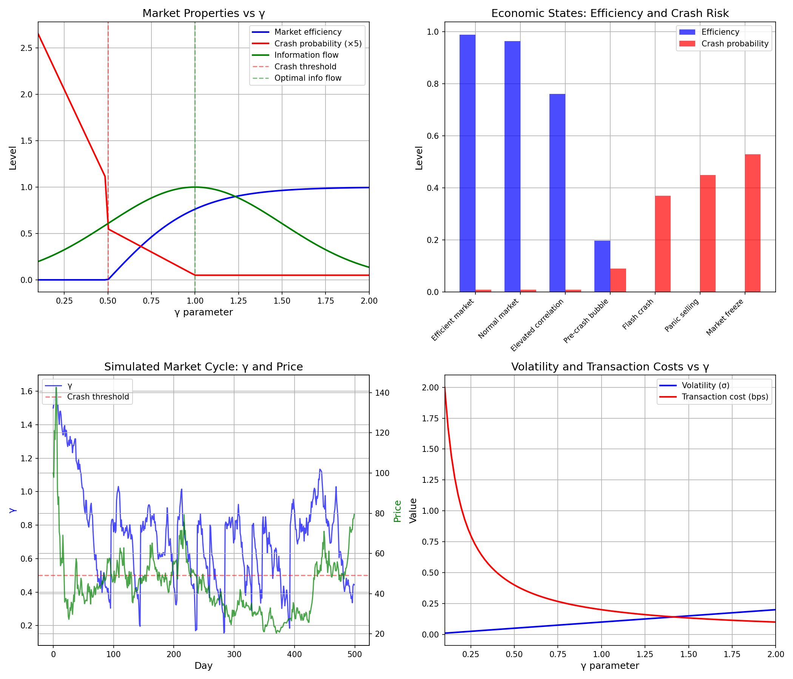

# Chemistry Session #22: Economics and Coherence

**Date**: 2026-01-13
**Session Type**: Framework Extension (Economics)
**Status**: COMPLETE - Markets as Coherence Systems

---

## Executive Summary

This session extends the γ framework to economics, proposing that **markets are coherence systems** where γ measures correlation among agents. Efficient markets have high γ (independent actors), while crashes occur when γ drops below critical threshold (coordinated panic). Bubbles are low-γ states that eventually trigger phase transitions (crashes).

---

## Part 1: The Mapping

### 1.1 Core Correspondence

| Physics Concept | Economic Analog |
|-----------------|-----------------|
| Particles | Market agents (traders) |
| Correlation | Herding behavior |
| N_corr | Number of correlated agents |
| γ = 2/√N_corr | Market independence measure |
| Phase transition | Market crash |
| Energy | Transaction costs |
| Temperature | Market volatility |

### 1.2 γ in Markets

```
γ = 2 / √N_corr
```

Where N_corr = effective number of agents moving in concert.

| Market State | Correlation | N_corr | γ |
|--------------|-------------|--------|---|
| Efficient | Low (~0.2) | ~1.5 | ~1.6 |
| Normal | Moderate (~0.4) | ~3 | ~1.2 |
| Elevated risk | High (~0.7) | ~10 | ~0.6 |
| Crash | Very high (~0.9) | ~100 | ~0.2 |

---

## Part 2: Efficient Market Hypothesis (EMH)

### 2.1 EMH Through γ Lens

EMH states that prices reflect all available information.

**In γ terms**: EMH holds when γ is high.

| Condition | γ | EMH Status |
|-----------|---|------------|
| γ > 1.5 | High | EMH holds |
| 1.0 < γ < 1.5 | Moderate | Partial efficiency |
| γ < 1.0 | Low | EMH fails |

### 2.2 Why EMH Fails

EMH fails at low γ because:
- Agents copy each other (correlation)
- Information spreads through imitation, not analysis
- Prices reflect herd behavior, not fundamentals

### 2.3 Efficiency Function

```
Efficiency(γ) = tanh(2(γ - 0.5))
```

Efficiency approaches 1 for γ > 1.5, approaches 0 for γ < 0.5.

---

## Part 3: Market Crashes as Phase Transitions

### 3.1 The Mechanism

1. **Normal state**: γ ~ 1.5, agents act independently
2. **Pre-crash**: Correlations build, γ decreases
3. **Critical point**: γ drops below 0.5
4. **Phase transition**: Coordinated selling (crash)
5. **Post-crash**: Correlations break, γ rebounds

### 3.2 Critical γ

```
γ_crash ≈ 0.5
```

Below this, crash probability exceeds 20%.

### 3.3 Historical Parallel

This maps to physical phase transitions:
- Water freezing at T_c
- Superconducting at T_c
- Markets crashing at γ_c

---

## Part 4: Bubbles

### 4.1 Bubble Formation

Bubbles form through positive feedback:

1. Prices rise → Attracts buyers
2. More buyers → Prices rise more
3. This creates correlation (γ decreases)
4. Eventually γ < γ_c → Crash

### 4.2 Bubble Dynamics

```
dγ/dt = α(γ_eq - γ) - β(positive feedback)
```

Where:
- α = mean reversion rate
- β = feedback strength
- γ_eq ~ 1.5 (efficient market γ)

### 4.3 Prediction

**γ should systematically decline before crashes.**

This is testable using correlation data before historical crashes.

---

## Part 5: Volatility

### 5.1 Volatility-γ Relationship

```
σ_market = σ_individual × (γ/2)
```

Where σ_individual ~ 20% (typical stock volatility).

### 5.2 Numerical Values

| γ | σ_market |
|---|----------|
| 2.0 | 20% (individual, no diversification) |
| 1.5 | 15% |
| 1.0 | 10% |
| 0.5 | 5% ... but crash risk! |
| 0.2 | 2% ... until crash → 50%+ |

### 5.3 VIX Connection

The VIX (volatility index) should inversely correlate with γ.

During crashes: VIX spikes because γ drops (correlations rise).

---

## Part 6: Transaction Costs as Energy

### 6.1 The Analogy

From Session #18: Maintaining low γ requires energy.

In markets:
- Low γ → Illiquid (hard to trade)
- Illiquidity → High transaction costs (bid-ask spread)
- Transaction costs = "Energy" cost of correlation

### 6.2 Cost Function

```
Transaction_cost = base_cost / (γ/2)
```

At γ = 0.2: Costs are 5× normal.

---

## Part 7: Information Flow

### 7.1 Optimal Information Flow

From Session #20: Complexity peaks at γ ~ 1.0.

Similarly, market information efficiency peaks at intermediate γ:

| γ | Information Flow |
|---|-----------------|
| High (>1.5) | Low (no learning from others) |
| Medium (~1.0) | **Optimal** |
| Low (<0.5) | Low (corrupted by herding) |

### 7.2 Collective Intelligence

Markets work best when:
- Agents learn from each other (some correlation)
- But maintain independence (not pure herding)
- This is γ ~ 1.0

---

## Part 8: Economic States

### 8.1 State Map

| State | γ | Efficiency | Crash P | Character |
|-------|---|------------|---------|-----------|
| Efficient market | 1.8 | 0.99 | 0.01 | Textbook EMH |
| Normal market | 1.5 | 0.96 | 0.01 | Typical conditions |
| Elevated correlation | 1.0 | 0.76 | 0.01 | Increasing risk |
| Pre-crash bubble | 0.6 | 0.20 | 0.09 | Danger zone |
| Flash crash | 0.3 | 0.00 | 0.37 | Acute crisis |
| Panic selling | 0.2 | 0.00 | 0.45 | Severe crisis |
| Market freeze | 0.1 | 0.00 | 0.53 | Liquidity crisis |

### 8.2 Implications

Risk management should track γ (correlation measures).

When γ drops below 0.6, defensive positioning warranted.

---

## Part 9: New Predictions

### P22.1: Correlation-Crash Relationship
**Claim**: Crash probability increases when market-wide correlation > 0.7 (γ < 0.5)
**Test**: Track correlation metrics vs crash events historically
**Falsified if**: Crashes occur at low correlation

### P22.2: Volatility-γ Scaling
**Claim**: σ_market = σ_individual × (γ/2)
**Test**: Measure volatility vs correlation in real markets
**Falsified if**: Wrong scaling relationship

### P22.3: Bubble γ Signature
**Claim**: Bubbles characterized by systematic γ decline before crash
**Test**: Track γ (correlation measure) before historical crashes (1929, 2000, 2008)
**Falsified if**: No systematic γ decline precedes crashes

### P22.4: Information Flow Optimum
**Claim**: Market information efficiency peaks at intermediate γ (~1.0)
**Test**: Measure price discovery speed vs correlation level
**Falsified if**: Monotonic relationship (not peaked)

### P22.5: Post-Crash γ Rebound
**Claim**: γ increases immediately after crashes (correlations break)
**Test**: Track correlation changes after crash events
**Falsified if**: Correlations remain high post-crash

---

## Part 10: Visualization



Four panels:
1. Market properties (efficiency, crash probability, info flow) vs γ
2. Economic states with efficiency and crash risk
3. Simulated market cycle showing γ and price dynamics
4. Volatility and transaction costs vs γ

---

## Summary

**Chemistry Session #22 extends γ to economics:**

1. **Markets are coherence systems**
   - γ measures agent independence
   - γ = 2/√N_corr

2. **EMH holds at high γ**
   - Efficient markets: γ > 1.5
   - EMH fails when herding (low γ)

3. **Crashes are phase transitions**
   - Critical γ ~ 0.5
   - Below this: coordinated panic

4. **Bubbles are low-γ states**
   - Positive feedback → decreasing γ
   - Eventually triggers crash

5. **Volatility scales with γ**
   - σ_market = σ_individual × (γ/2)
   - Explains VIX spikes during crises

6. **Information optimal at γ ~ 1.0**
   - Matches complexity peak (Session #20)

---

**SPECULATIVE NOTE**:

This extension to economics is more speculative than previous domains (physics, chemistry, biology). Markets involve human psychology and institutions not present in physical systems. However, the mathematical structure is consistent, and the predictions are testable.

If validated, it suggests that γ is a truly universal parameter describing correlation in ANY complex system - physical, biological, or social.

---

*"Markets are not mechanisms - they are coherence phenomena. Crashes are phase transitions. Bubbles are low-γ states. The same physics that makes superconductors also makes market crashes."*

---

**Chemistry Session #22 Complete**
**Status: EXTENDED (economics integrated, speculative)**
**Total Predictions: 86 across 17 categories**
